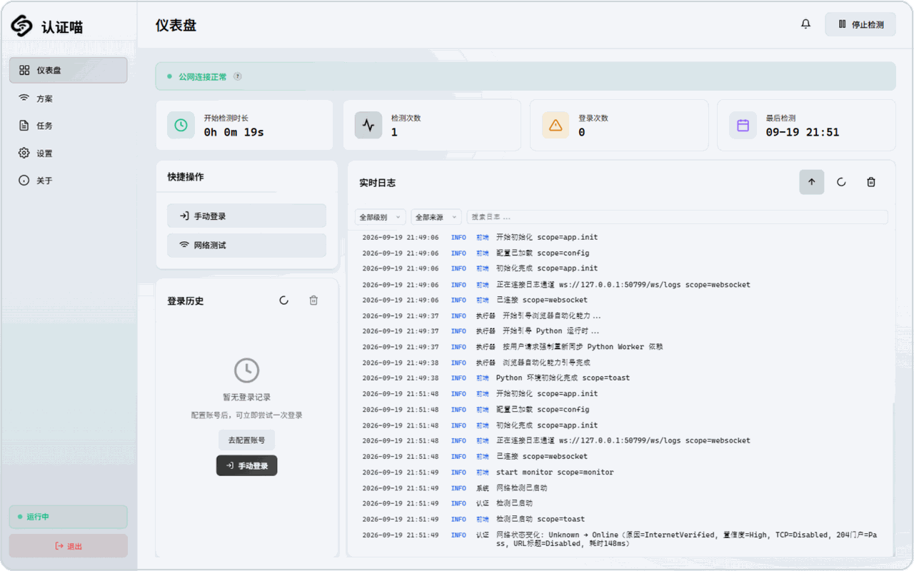
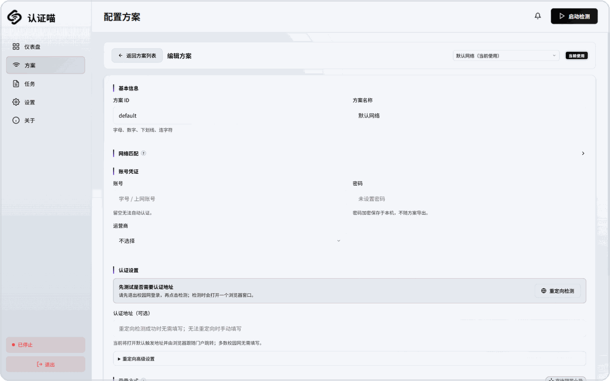
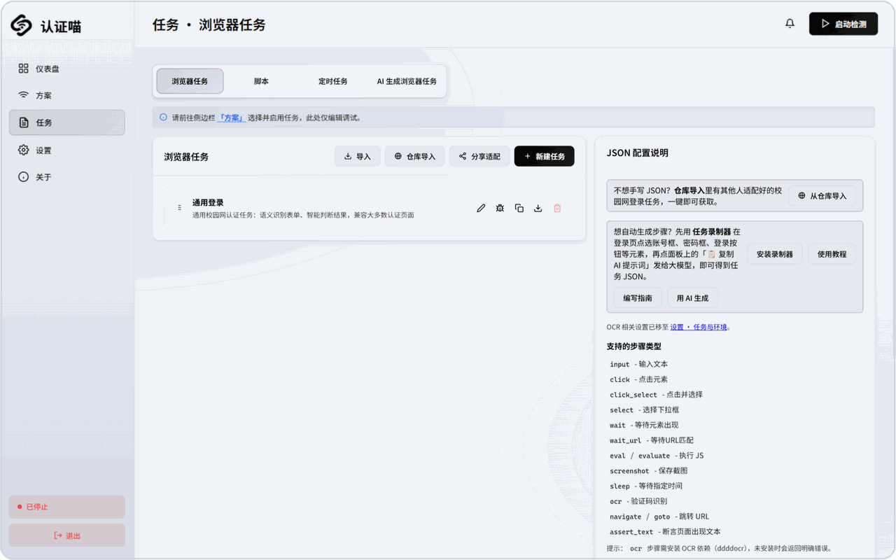
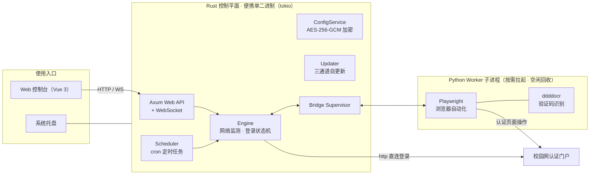

<div align="center">

# 认证喵（Campus-Auth）

校园网自动认证工具 · Rust 重写版

<picture>
  <source media="(prefers-color-scheme: dark)" srcset="docs/assets/logo-dark.png">
  
</picture>

[](https://github.com/Misyra/Campus-Auth-rs/actions/workflows/ci.yml)
[](https://github.com/Misyra/Campus-Auth-rs/stargazers)
[](https://github.com/Misyra/Campus-Auth-rs/forks)
[](https://github.com/Misyra/Campus-Auth-rs/releases)
[](https://github.com/Misyra/Campus-Auth-rs/issues)
[](https://github.com/Misyra/Campus-Auth-rs/graphs/contributors)
[](LICENSE)


</div>

检测到校园网强制门户（captive portal）时自动打开认证页面并完成登录：支持多 Profile 自动匹配、
浏览器自动化与直连请求两种登录方式、验证码 OCR、cron 定时任务、系统托盘与内置 Web 控制台。

Rust 重写版为**便携式单二进制 + Python 子进程**：网络监测、登录状态机、调度、配置、Web API、
系统托盘等控制平面全部在 Rust 侧；浏览器自动化按需拉起 Python Worker（Playwright），空闲自动
关闭释放内存。Windows 便携版解压即用，另有 Docker 多架构镜像。

## 功能特性

**认证核心**

- **自动认证**：断网 / 被劫持时自动触发登录，支持重试、冷却与失败去重提醒
- **多 Profile**：按网关 IP / WiFi SSID 自动匹配（约束条件多者优先），支持手动切换
- **双登录方式**：浏览器自动化（Playwright）或直连请求登录（Rust 内直接发 HTTP，免 Python、免浏览器，见[直连登录指南](docs/guides/http-login-guide.md)）
- **验证码识别**：OCR 识别登录验证码，识别失败自动重试整个流程

**自动化**

- **浏览器自动化**：Playwright 驱动完整步骤序列（导航 / 填表 / 点击 / 验证码 / 断言）
- **定时任务**：cron 表达式调度，支持打卡签到等日常自动化
- **AI 任务生成**：视觉模型按捕获页面自动生成浏览器任务（设置页开启）

**界面与体验**

- **Web 控制台**：内置 Vue 3 Web UI，状态查看、任务编辑、日志与实时 WebSocket 推送
- **系统托盘**：常驻托盘；首行为状态行（引擎 · 网络 · 登录态，运行中高亮、未运行灰化），提供启动 / 停止监测、手动登录、打开控制台、退出
- **运行模式预设**：「日常使用」与「排查问题」两套预设一键切换，确认前列出具体改动项
- **方案导入导出**：认证方案（认证地址、直连参数、匹配规则等）导出 JSON 分享，导入前展示内容与脚本原文，凭据不随包导出

**运维**

- **自动更新**：版本检查与全量包更新，三通道可选（stable / prerelease / all），支持手动放置或选择安装包更新

## 界面预览

<div align="center">


<br/>




<p><sub>仪表盘（运行状态 · 快捷操作 · 实时日志） · 认证方案编辑 · 任务管理（浏览器任务 / 脚本 / 定时任务 / AI 生成）</sub></p>
</div>

## 快速开始

### 便携版（Windows）

1. 从 [Release](https://github.com/Misyra/Campus-Auth-rs/releases) 下载便携包并解压
2. 双击 `campus-auth.exe` 启动（或命令行运行）
3. 首次启动在系统托盘或 Web 控制台 `http://127.0.0.1:50721` 配置学校认证信息
4. Python Worker（Playwright）首次需要时自动安装修复；验证码任务再到「设置 · 任务与环境」按需启用 OCR

### 从源码构建

```bash
# 1. 构建前端（生成 frontend/dist 供 rust-embed 嵌入）
cd frontend && npm install && npm run build && cd ..

# 2. 编译运行
cargo build
cargo run
```

> 前端未构建时可用 `cargo check --features no-embed` 跳过嵌入完成编译检查。
>
> 要求：Rust 1.85+（Edition 2024）与 Node.js。仓库经 `rust-toolchain.toml` 固定 1.98 构建工具链，装有 rustup 时本地与 CI 自动采用；自编译环境只需满足 1.85+。

### Docker 部署

```bash
# 拉取预构建镜像并启动（后台）
docker compose pull
docker compose up -d

# 日志与健康检查
docker compose logs -f
curl http://localhost:50721/api/health
```

Web 控制台 `http://localhost:50721`，数据持久化于命名卷 `campus-auth-data`（`config/` / `tasks/` / `logs/`）。

默认拉取 `ghcr.io/misyra/campus-auth-rs:prerelease` 多架构镜像。需要固定版本时设置
`CAMPUS_AUTH_IMAGE=ghcr.io/misyra/campus-auth-rs:v5.0.1`；需要从当前源码构建时使用：

```bash
docker compose -f docker-compose.yml -f docker-compose.build.yml up -d --build
```

宿主机目录挂载、host 网络等进阶用法见 [docker/README.md](docker/README.md)。

<details>
<summary>仅用 Docker CLI（不使用 compose）</summary>

```bash
# 端口同样只绑回环；--restart 必需：容器内定时自重启（默认 24h）会让主进程退出，
# 无重启策略的容器将停在 exited 不再回来。--stop-timeout 覆盖默认 10s，
# 给 26s 的优雅关闭预算留足时间（否则 Bridge 等待 Worker 时被 SIGKILL，残留孤儿浏览器）
docker build -t campus-auth .
docker run -d --name campus-auth --restart unless-stopped --stop-timeout 40 \
  -p 127.0.0.1:50721:50721 -v campus-auth-data:/data campus-auth
```

</details>

## 命令行速查

| 命令 | 作用 |
|------|------|
| `campus-auth` | 完整模式启动（Web + 托盘 + 引擎，缺省读 `settings.json`） |
| `campus-auth --mode lightweight` | 轻量模式（仅引擎 + 托盘，Web 按需启动） |
| `campus-auth --mode login-once` | 执行一次登录后退出 |
| `campus-auth --status` / `--stop` | 查询 / 停止运行中的实例 |
| `campus-auth --force` | 强制终止已有实例后启动 |
| `campus-auth --autostart enable` / `disable` | 注册 / 取消开机自启动 |
| `campus-auth --startup-action monitor` / `login_once` | 覆盖启动动作（默认 `none` 不自动执行） |
| `campus-auth --no-browser` / `--no-tray` | 不自动打开浏览器 / 不显示托盘 |
| `campus-auth --port 50721 --host 127.0.0.1 --base-path <dir>` | 覆盖监听端口 / 地址 / 数据根目录 |

等价环境变量：`CAMPUS_AUTH_PORT` / `CAMPUS_AUTH_HOST` / `CAMPUS_AUTH_BASE_PATH`。全部参数见 `campus-auth --help`。

## 使用说明

- **Web 控制台**：默认 `http://127.0.0.1:50721`；回环端口被占用或被 Windows 保留时，改绑端口 0 由系统随机分配，实际端口见启动日志
- **Profile（认证方案）**：含认证地址、用户名 / 密码（AES-256-GCM 加密落盘）、网关 / SSID 匹配规则与关联任务，可在方案间手动切换
- **登录方式**（每方案二选一）：
  - **浏览器渠道**：填写认证网址即直接使用，留空由浏览器跟随校园网重定向登录；支持「重定向检测」辅助判断是否需要填写
  - **直连渠道**：Rust 内直接发 HTTP 请求完成认证，支持占位符与沙箱凭据变换脚本，见 [docs/guides/http-login-guide.md](docs/guides/http-login-guide.md)
- **任务**：浏览器任务（JSON 步骤序列）与本地脚本任务两类，均可被定时调度；内置任务录制用户脚本，可在浏览器上录制操作生成任务
- **更新**：设置页选择通道 `stable`（正式版）/ `prerelease`（测试版）/ `all`（全通道最新），`auto_check_enabled` 为总开关；也支持手动更新——将安装包放入 `update/` 目录，或在更新页直接选择安装包

## 文档

| 文档 | 内容 |
|------|------|
| [用户指南](docs/guides/user-guide.md) | 启动参数、运行时目录、Web 控制台、Profile、托盘、OCR、更新与手动放置安装包、FAQ |
| [任务使用手册](docs/guides/task-manual.md) | 任务的日常使用（存储位置、关联方案、调度） |
| [浏览器任务编写指南](docs/guides/task-writing-guide.md) | 浏览器任务 JSON 的步骤类型与字段语义 |
| [自定义脚本指南](docs/guides/custom-script-guide.md) | 本地脚本任务的编写与执行 |
| [直连登录指南](docs/guides/http-login-guide.md) | HTTP 直连登录的参数配置 |
| [用户更新日志](docs/updatelog.md) / [开发更改日志](docs/changelog.md) / [已知问题](docs/known-issues.md) | 版本变化与遗留问题 |

## 架构



Rust 侧负责控制平面（网络监测、登录状态机、调度、配置、Web API、托盘），浏览器自动化作为
Python 子进程按需拉起、空闲自动关闭；Worker 崩溃不影响 Rust 控制平面。更多技术细节见 [AGENTS.md](AGENTS.md)。

## 项目结构

```
campus-auth/
├── src/                 # Rust 控制平面（监测 / 登录 / 调度 / 配置 / Web / 托盘）
├── frontend/            # Vue 3 + TypeScript + Vite Web 控制台
├── python_worker/       # Python Worker 子进程（Playwright + OCR）
├── tests/               # Rust 集成测试（含 mock 门户与 E2E 全链路）
├── docs/                # 文档（updatelog / changelog / 已知问题 / plan-next 活跃计划 / guides 用户指南）
├── resources/           # 静态资源（图标 / 脚本）
├── docker/              # Docker 辅助（entrypoint / 进阶用法说明）
└── openapi.json         # Web API 路径清单
```

更多技术细节（架构、模块划分、开发规范、测试）见 [AGENTS.md](AGENTS.md)。

## 开发与贡献

- 提交规范：Conventional Commits，中文描述（详见 [AGENTS.md](AGENTS.md) 的 Git 规范）
- 开发命令：`cargo build` / `cargo test` / `cargo clippy -- -D warnings` / `cargo fmt`
- CI：`cargo fmt --check` + `clippy --all-targets -D warnings` + `cargo test`（含 `rust-tests-unix` 与 `e2e-login-chain` mock→二进制→Worker 全链路）+ 前端构建（`vue-tsc` + `vite build`）+ `vitest` + `compileall` + `uv run pytest`（见 `.github/workflows/ci.yml`）
- Web API 路径见 [openapi.json](openapi.json)，字段级契约以 [frontend/src/api/types.ts](frontend/src/api/types.ts) 为准

<details>
<summary><strong>Star History</strong></summary>

[](https://star-history.com/#Misyra/Campus-Auth-rs)

</details>

## 第三方资源

- **Noto Sans SC**（Web 控制台正文字体）：版权归 Google Inc.，以 [SIL Open Font License 1.1](https://scripts.sil.org/OFL) 授权。
  字体不随本仓库分发，也不内嵌进二进制——`frontend/index.html` 经 jsDelivr 引用 `@fontsource-variable/noto-sans-sc`，由浏览器按 `unicode-range` 分片按需加载；断网时回落系统字体栈。
  该 CDN 域名已在 Web 控制台的 CSP `style-src`（外部样式表本身）与 `font-src`（其内 `@font-face` 指向的字体文件）中放行（`src/web/mod.rs`）。若需自托管或调整字重集，替换该 CDN 引用即可。
- **其他前端依赖**：见 [`frontend/package.json`](frontend/package.json)；Rust 依赖见 [`Cargo.toml`](Cargo.toml)。

## 许可证

本项目基于 [AGPL-3.0-only](LICENSE) 发布。仅用于合法的校园网身份认证场景，请遵守所在学校与运营商的网络使用规范。
